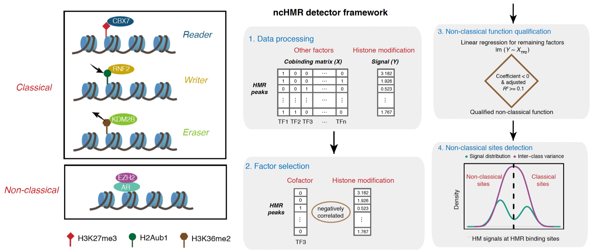

# ncHMR_detector: a computational framework to systematically reveal non-classical functions of histone-modification regulators

Histone modification regulators (HMR) play important roles in many biological process and function by catalyzing or binding known histone modifications. Abundant studies mapped the genome-wide profiles of HMRs through ChIP-Seq and most of them only focused on the relationship between HMRs and their known histone modification substrates. However, there were still some studies showed that several HMRs can bind to  sites (defined as without colocalization of known histone modifications) which were involved in development, differentiation et al. Thus, ncHMR_detector is sepcifically designed for detecting non-classical function of given HMR and predicting the potential cofactors of the non-classical function.

Idea of HMR function and the workflow for detection


## 1. Installation
ncHMR_detector requires [python](https://www.python.org) v2.7 and [R](https://www.r-project.org) v2.14+ to run.

\# for root user
```sh
$ cd ncHMR_detector/ncHMR_detector_v1.0/
$ sudo python setup.py install  
```
\# if you are not root user, you can install ncHMR_detector at a specific location which you have write permission
```sh
$ python setup.py install --prefix /home/ncHMR_detector  # here you can replace “/home/ncHMR_detector” with any location 
$ export PATH=/home/ncHMR_detector/bin:$PATH    # setup PATH for the software
$ export PYTHONPATH=/home/ncHMR_detector/lib/python2.7/site-packages:$PYTHONPATH    # setup PYTHONPATH for module import
```
\# To check the ncHMR_detector package, just type:
```sh
$ ncHMR_detector --help  # If you see help manual, you have successfully installed the ncHMR_detector
```
\# Install pdflatex 
Before you start running, ncHMR_detector will check your computer for pdflatex. If you have already installed pdflatex, ncHMR_detector will generate a summary report in addition to regular outputs and analysis results.
- To install pdflatex on macOS, you can download “MacTex” from http://www.tug.org/mactex/. After downloading the package MacTex.pkg from http://tug.org/cgi-bin/mactex-download/MacTeX.pkg, you just double click to install MacTex and get the pdflatex.
- For linux user, you can type the following cmd line to install pdflatex on your server/computer.
```sh
$ apt-get install texlive-all
```
- The installation of pdflatex on both mac and linux requires root privilege.


\# NOTE: 
- To install ncHMR_detector on MacOS, users need to download and install Command Line Tools beforehand.
- ncHMR_detector requires [bedtools](https://github.com/arq5x/bedtools2/) pre-installed (otherwise the software will install bedtools to the same folder as ncHMR_detector).
- ncHMR_detector requires R package [glmnet](https://cran.r-project.org/web/packages/glmnet/index.html) pre-installed (otherwise the software will install glmnet in a temporary directory everytime).


## 2. Download pre-processed database
Download our pre-processed database for the binding sites of histone modification regulators (HMR) and transcription factors (TF) in different cell types/cell lines. The genome-wide binding sites for TFs and HMRs are defined by published ChIP-seq data. We collected data for all the TFs and HMRs with available ChIP-seq data in public domain, processed and generated a peak file for each TF in each cell line. Users can download the binding sites of all the TFs and HMRs in given cell types and input the absolute path of the folder as a parameter of ncHMR_detector (-f, --peakfolder). Users can also customarize the database by adding additional peak files for the specific TFs and HMRs they interested in as the potential candidates of cofactors. Currently the built-in database support: 
- K562 (hg38) 
[Dropbox](https://www.dropbox.com/s/8wvnvzqz6xdf81h/K562_peaks.tar.gz?dl=0) 
- GM12878 (hg38) 
[Dropbox](https://www.dropbox.com/s/uxhor96sd61afv9/GM12878_peaks.tar.gz?dl=0) 
- human ESC (hg38) 
[Dropbox](https://www.dropbox.com/s/rrw908zvn895vx4/hESC_peaks.tar.gz?dl=0) 
- mouse ESC (mm10) 
[Dropbox](https://www.dropbox.com/s/j6m07xaxilvg7v4/mESC_peaks.tar.gz?dl=0) 

You can download by simply click the link on the cell type name and use the following command to extract the folder:
```sh
$ tar xvzf K562_peaks.tar.gz
$ tar xvf K562_peaks.tar  # used when your OS uncompress the package automatically
```

## 3. Run ncHMR_detector (usage)
#### Essential paramters
To run ncHMR_detector with default parameters, you only need to give ncHMR_detector:
-   -p HMRPEAK, --HMRpeak=HMRPEAK
peak file for HMR binding sites, absolute path required
-   -s SIGNAL, --Signal=SIGNAL
bigWig file for histone modification (HM) signal, absolute path required
-   -f PEAKFOLDER, --peakFolder=PEAKFOLDER
the folder name for all the peak files of all the TF candidates (could be the folder you downloaded in step2, absolute path required)
-   -o OUTNAME, --outname=OUTNAME
output name, prefix name of your output files 

Example for run ncHMR_detector with all default parameters:
```sh
$ ncHMR_detector -p ${path}/mESC_GSM1562337_CBX7.bed -s ${path}/mESC_GSM1399500_H3K27me3.bw -f ${path}/mESC_peaks/ -o mESC_GSM1562337_CBX7
```

#### Options
You can also specify the following options for more accurate prediction results:
-  -\-extend=EXT         
Length of peak region to consider HM signal, default is +/- 1000bp from each HMR peak center
-  -\-Pvalue=PVALUE
Cutoff of P-value, default is 0.001
-  -\-Alpha=ALPHA
The alpha parameters for elasticNet, choose from 0~1, 1 for lasso and 0 for ridge, default is 0.5
-  -\-LambdaChoice=LAMBDACHOICE
Solution to determine Lambda (choose from 1se and min, default is 1se. "min" is the value at which the minimal mean squared error is achieved and "1se" is for the most regularized model whose mean squared error is within one standard error of the minimal.)
-  -\-TopNcofactors=TOPNCOFACTORS
TopN predicted cofactors with highest association with non-classical function is reported (choose any number or all(default) to report topN predicted cofactors that pass the thresholds)
-  -\-overwrite
Force overwrite, this cmd will rm existing result if set !!

## 4. Output files
1. `NAME_summary.pdf` is the summary pdf file which contains information of:
     - Input file and parameter description
     - Cross validation curve from elastic-net feature selection
     - Summary of predicted cofactors for non-classical function (leave blank if no non-classical function was detected)
     - Distribution (boxplot) of histone modificaion signal on classical and al funtion (defined by different cofactor candidates)

    \# Note: 
    1. This pdf file is generated only if pdflatex is pre-installed. 
    2. Only top 4 cofactors with most significant R-squared are listed in this pdf.
    3. You can check the `summary/` folder for all the other related results including the full cofactor list (see the following files)


2. `summary/NAME_NCsummary.txt` is the full list of cofactors which are predicted to be significantly related to the non-classical function of the given HMR. You can open it in excel and sort/filter using excel functions. Information include:
    - TFname: name of the cofactors, same as the name of peak files in the `--peakfolder`
    - HMname: name of the histone modification, useful when multiple histone modification bigWig files are provided. 
    - Pval: Empirical P-value from the permutation results
    - R2: R-squared from the linear regression
    - coeff: coefficient from the linear regression
    - num_NCsites: number of the al sites defined by the given TF and HM
    
    \# Note: Terms were filtered by P-value and further sorted by the R-squared

3. `summary/NAME_elnet_lambdaSelection.pdf` is the cross validation curve from elastic-net feature selection
4. `summary/NAME_cofactor_HMsignal.pdf` is the summary of predicted cofactors for non-classical function (not generated if no non-classical function was detected)
5. `summary/NAME_summary.tex` is the .tex file for generating latex pdf. You can also move the whole `summary/` folder to another OS with pdflatex and run the following cmd line to re-generate the summary pdf file. 
```sh
$ pdflatex NAME_summary.tex
```

## 5. Testing data and example of output files
We provided the testing data (in mouse ESC) for users to test the flexibility and the power of the ncHMR_detector and the example of `summary.pdf` which generated from a new detected non-classical function in our recent studies (using the example cmd line in step 3). Click the file names to download. 
- HMRpeaks(CBX7)
[Dropbox](https://www.dropbox.com/s/1kkow0nnmtkinv1/mESC_GSM1562337_CBX7.bed?dl=0)
- Signal(H3K27me3) 
[Dropbox](https://www.dropbox.com/s/c5h9qf3qvetfe2s/mESC_GSM1399500_H3K27me3.bw?dl=0)
- Summary(output): 
[Dropbox](https://www.dropbox.com/s/cagfxfhdjq2hksg/mESC_GSM1562337_CBX7_summary.pdf?dl=0)


## 6. Change log
v1.0 (2019.05.03) The first released version, which generates the results of the paper.


